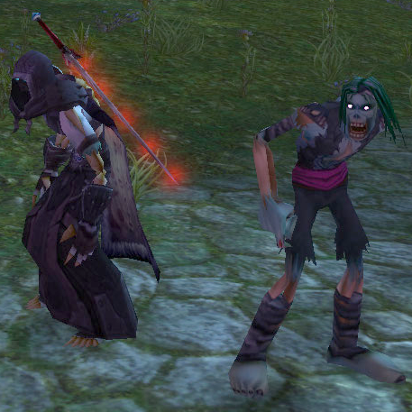
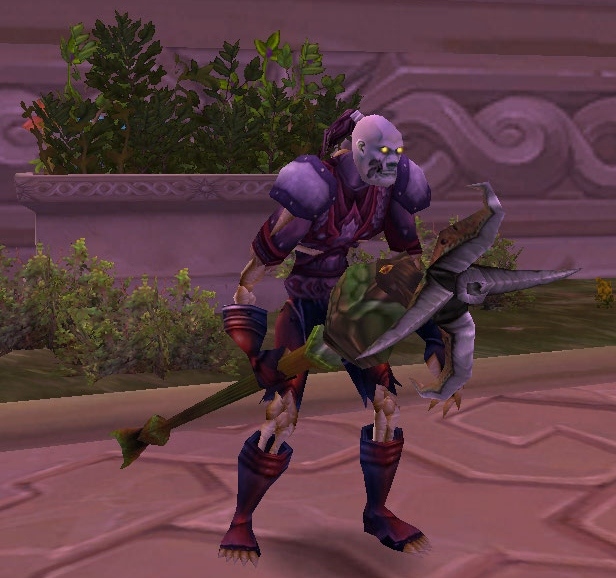
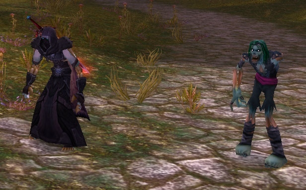
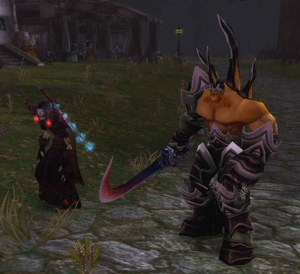
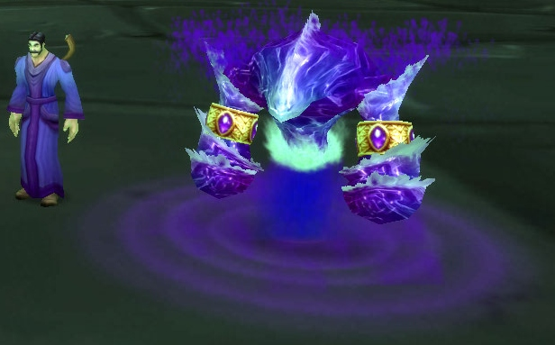

# mod-morphsummon<br>(Discontinued as of 2024-07-29)




## Description

This module allows Warlocks, Death Knights and Mages to alter the appearance of their summoned permanent creatures (incl. the Felguard's weapon). The appropriate model / item IDs can be specified in the configuration file.


## How to use ingame

As GM:
- add NPC permanently:
 ```
 .npc add 601072
 ```
- add NPC temporarily:
 ```
 .npc add temp 601072
 ```


## Installation

Clone Git repository:

```
cd <SolDir>
git clone https://gitlab.com/opfesoft/mod-morphsummon.git modules/mod-morphsummon
```

Import SQL:
```
cd <SolDir>
bash bash/db_assembler.sh 4
mysql -P <DBport> -u <DPuser> --password=<DBpassword> world <local/sql/world_custom.sql
mysql -P <DBport> -u <DPuser> --password=<DBpassword> characters <local/sql/characters_custom.sql
```

Without DB Assembler:
```
cd <SolDir>
mysql -P <DBport> -u <DPuser> --password=<DBpassword> world <modules/mod-morphsummon/data/sql/db-world/morphsummon.sql
mysql -P <DBport> -u <DPuser> --password=<DBpassword> characters <modules/mod-morphsummon/data/sql/db-characters/morphsummon_ddl.sql
```


## Edit module configuration (optional)

If you need to change the module configuration, go to your server configuration folder (e.g. `sol-srv/etc`), copy `morphsummon.conf.dist` to `morphsummon.conf` and edit that new file.


## Screenshots







## Credits

[Stoabrogga](https://gitlab.com/Stoabrogga): author


## License

This code and content is released under the [GNU AGPL v3](LICENSE.md).
